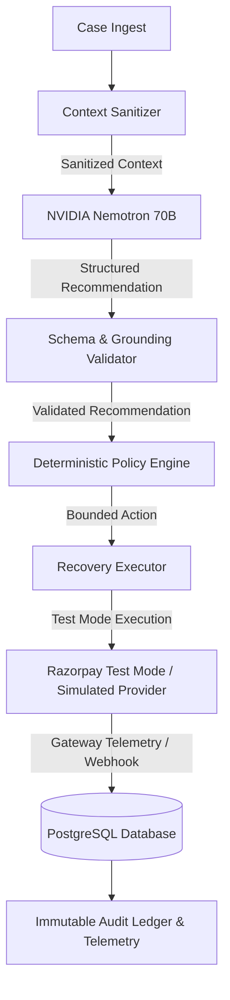

# RECLAIM — NVIDIA Nemotron AI Recovery Intelligence

## 1. Overview & Architecture

RECLAIM integrates NVIDIA Nemotron via NVIDIA's OpenAI-compatible hosted API as the AI reasoning and decision-intelligence layer for payment recovery.

### Core Principle
> **AI recommends. Policy decides. Backend executes.**

The AI reasoning layer operates strictly as an advisory service. It has **no authority** to move money, invoke payment gateway APIs (e.g. Razorpay), change policy, modify database records, or authorize recovery transactions.



---

## 2. NVIDIA Hosted API Integration

- **Base URL**: `https://integrate.api.nvidia.com/v1`
- **Endpoint**: `/chat/completions`
- **Protocol**: OpenAI-compatible JSON Chat Completions
- **Default Model**: `nvidia/llama-3.1-nemotron-70b-instruct`
- **HTTP Client**: Lightweight server-side client (`httpx`) with a bounded 10-second timeout.
- **No Agent Frameworks**: Does NOT use LangChain, LangGraph, AutoGen, CrewAI, or Vector DBs.

---

## 3. Configuration & Environment Variables

| Variable | Scope | Default | Description |
|---|---|---|---|
| `NVIDIA_API_KEY` | Backend Only | `""` | NVIDIA API Key. NEVER exposed to browser or client. |
| `NVIDIA_NEMOTRON_MODEL` | Backend Only | `nvidia/llama-3.1-nemotron-70b-instruct` | Configurable NVIDIA Nemotron model name. |
| `AI_PROVIDER` | Backend Only | `nemotron` | Mode: `nemotron`, `mock`, or `deterministic`. |
| `NVIDIA_API_BASE_URL` | Backend Only | `https://integrate.api.nvidia.com/v1` | Hosted API base endpoint. |
| `AI_REQUEST_TIMEOUT_SECONDS`| Backend Only | `10.0` | Bounded execution timeout. |

---

## 4. Sanitized Context (Input Contract)

Context sent to NVIDIA Nemotron is strictly minimized to prevent data leakage and prompt injection.

### Allowed Context Fields:
- `case_id`: Identifier for correlation
- `failure_type`: Specific failure category (e.g. `UPI Timeout`, `Card Decline`, `Insufficient Funds`)
- `amount_minor`: Integer paise (e.g., `49900` for ₹499.00)
- `currency`: Currency code (`INR`)
- `payment_age`: Duration since failure (e.g., `12 min`)
- `retry_count`: Previous retry attempts
- `previous_recovery_attempts`: Count of recovery executions
- `previous_communication_count`: Contacts sent within 24h
- `previous_recovery_outcomes`: List of prior attempt states
- `provider_status`: Gateway status
- `case_priority`: Priority tier (`Critical`, `High`, `Medium`)
- `merchant_policy_summary`: Read-only policy constraints (`max_retries`, `max_contacts_24h`, `max_autonomous_amount_minor`, `min_recovery_probability`)
- `customer_message`: Wrapped in `<customer_text>...</customer_text>` tags.

### Strictly Excluded (Data Minimization):
- ❌ No API Keys or Webhook Secrets
- ❌ No Credit Card numbers, CVV, or UPI PINs
- ❌ No Customer Passwords or Auth Tokens
- ❌ No Customer Email or Phone numbers
- ❌ No Full Database Records or Table dumps

---

## 5. Structured Recommendation (Output Contract)

Nemotron returns a strictly formatted JSON object adhering to the schema below:

```json
{
  "diagnosis": "Transient payment network timeout at NPCI switch",
  "recommended_intervention": "RETRY_PAYMENT",
  "rationale": "The payment failed with a transient provider error and has not exceeded the configured retry ceiling, so one bounded retry is optimal.",
  "evidence": [
    {
      "field": "failure_type",
      "value": "UPI Timeout",
      "reason": "Transient network failure indicates high probability of success on single retry"
    },
    {
      "field": "retry_count",
      "value": 0,
      "reason": "Case has not exhausted retry ceiling"
    }
  ],
  "confidence": 0.88,
  "urgency": "high",
  "expected_recovery_minor": 49900,
  "alternatives": [
    {
      "intervention": "CUSTOMER_REMINDER",
      "reason_not_preferred": "Direct retry has faster settlement and lower friction",
      "estimated_confidence": 0.62
    }
  ],
  "do_not_do": [
    "Do not exceed maximum configured retry count",
    "Do not trigger duplicate retries if verification is pending"
  ],
  "policy_dependencies": [
    "max_retries",
    "max_autonomous_amount_minor"
  ]
}
```

### Supported Interventions:
- `RETRY_PAYMENT`
- `WAIT_AND_RETRY`
- `CUSTOMER_REMINDER`
- `ALTERNATIVE_PAYMENT_METHOD`
- `MANUAL_REVIEW`
- `NO_ACTION`

---

## 6. Deterministic Policy Boundary & Financial Safety

1. **Policy Gate Authority**:
   Even if Nemotron returns `RETRY_PAYMENT` with `confidence = 0.99`, if the deterministic `PolicyEngine` evaluates a rule violation (e.g. `amount > max_autonomous_amount` or `retry_count >= max_retries`), the final status is **BLOCKED**.
2. **Amount Bounding**:
   `expected_recovery_minor` is strictly bounded by the backend to `min(expected_recovery_minor, case.amount)`.
3. **Stale Recommendation Defense**:
   Policy validation is re-executed authoritatively against the live database at the exact moment of recovery execution. A recommendation generated under Policy version N cannot bypass Policy version N+1.
4. **No Direct Execution**:
   Nemotron cannot call Razorpay, alter database balances, or mark cases as recovered. Verified settlement is PostgreSQL-authoritative.

---

## 7. Free-Tier / No-Key Deterministic Fallback

When `NVIDIA_API_KEY` is not present, or if the NVIDIA endpoint times out (10s) or encounters an error (429, 5xx, or malformed JSON):
- The system automatically engages the deterministic decision engine.
- The decision response explicitly returns `decision_source = "DETERMINISTIC_FALLBACK"`.
- No fake AI responses or fabricated hallucinations are produced.
- The UI visibly displays `Deterministic fallback`.

---

## 8. Provider Abstraction

- `AIRecoveryProvider` (Abstract Base Class)
- `NemotronRecoveryProvider` (Live NVIDIA Hosted API with strict schema and context grounding validation)
- `MockAIRecoveryProvider` (Test double supporting deterministic scenarios: `HIGH_CONFIDENCE_RETRY`, `MANUAL_REVIEW`, `NO_ACTION`, `POLICY_CONFLICT`, `INVALID_JSON`, `TIMEOUT`, `OVER_LIMIT_AMOUNT`, `INVENTED_EVIDENCE`)

---

## 9. Telemetry & Audit

- **Audit Events**:
  - `AI_RECOMMENDATION_GENERATED` (logs model, confidence, recommended intervention, latency, policy status; no API keys)
  - `AI_FALLBACK_TRIGGERED` (logs error category and fallback source)
- **Telemetry Metrics**:
  - `invocation_count`
  - `success_count`
  - `fallback_count`
  - `validation_failure_count`
  - `timeout_count`
  - `policy_override_count`
  - `average_latency_ms`

---

## 10. Security Verification

- All NVIDIA credentials remain strictly backend-only.
- No `NEXT_PUBLIC_NVIDIA_*` keys exist.
- No secrets appear in client bundles, browser localStorage, Git history, or log streams.
